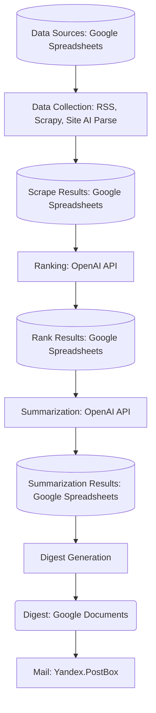

# Custom AI News Searcher

Сервис позволяет настроить рассылку самых важных (важность определяется пользователем) новостей за период времени по определённой тематике, целиком контролируя каждый шаг обработки информации - от выбора источников до вёрстки дайджеста.

[Рабочий сайт](https://banz-ai.ru)

## Исходная задача

Разработать прототип, который будет автоматически собирать и анализировать информацию с выбранных сайтов, формировать дайджест новостей и выделять самую важную информацию для ИТ подразделения.

## Подробнее о кейсе НЛМК

ИТ подразделение сталелитейной компании нуждается в оперативной информации о новейших продуктах, инициативах конкурентов, инновациях в системах хранения и управления данными, законодательных требованиях, открытиях и других событиях, которые могут повлиять на стратегию компании. В настоящее время поиск информации происходит вручную, что требует больших временных затрат и может привести к упущению важных событий.

## Архитектура системы

### Стек технологий
- Язык программирования: Python.
- Библиотеки для веб-скрейпинга: Scrapy.
- Система хранения данных: Google Docs, YDB.
- Средства анализа данных: OpenAI API (GPT-3.5, GPT-4).
- Интерфейс для настройки LLM: LangChain
- Интерфейс для отображения результатов: Vue, Vuetify

### Модули системы
- Модуль сбора данных (веб-скрейпинг с использованием Selenium).
- Модуль хранения данных (Google Docs).
- Модуль анализа данных с использованием OpenAI API.
- Модуль генерации дайджеста с помощью OpenAI API.
- Модуль отображения данных (Streamlit и Telegram Bot).

### Перечисление модулей системы

1. **Data Sources: Google Spreadsheets** - [таблица](https://docs.google.com/spreadsheets/d/1BA1nioQqc048FFvKXcpP5VqL_73kXNCcSx0m-jhI2MQ/edit?pli=1&gid=0#gid=0) с указанием ссылки на источник данных и его тип
2. **Data Collection: RSS, Scrapy, Site AI Parse** - модуль сбора информации, собирающий данные одним из трёх способов.
3. **Scrape Results: Google Spreadsheets** - [таблица](https://docs.google.com/spreadsheets/d/1BA1nioQqc048FFvKXcpP5VqL_73kXNCcSx0m-jhI2MQ/edit?gid=2038294867#gid=2038294867) с хранящимися ссылками и текстами статей
4. **Ranking: OpenAI API** - модуль оценки статьи с помощью структурированного промпта
5. **Rank Results: Google Spreadsheets** - [таблица](https://docs.google.com/spreadsheets/d/1cIB0yjbP-uInz7k0rs7zRruyct7C3Cks3P7DUGZTFlc/edit?gid=0#gid=0) с результатами оценки статей
6. **Summarization: OpenAI API** - модуль суммаризации текста первых 5 статей по сумме баллов
7. **Summarization Result: Google Spreadsheets** - [таблица](https://docs.google.com/spreadsheets/d/1cIB0yjbP-uInz7k0rs7zRruyct7C3Cks3P7DUGZTFlc/edit?gid=1994196678#gid=1994196678) с саммари статей из топа
8. **Digest Generation** - модуль заполнения документа дайджеста из суммаризованных новостей
9. **Digest: Google Documents** - [Google-документ](https://docs.google.com/document/d/1Rtfhw54kpkmuPmA7xpt9CVx5J_70kMiL636MQzl3dck/edit) дайджеста с заполненной информацией
10. **Mail: Yandex.PostBox** - Сервис рассылки

### Основной поток данных


## API Документация

[Посмотреть документацию API](http://45.133.178.134:35474/docs)

### Методы

#### `/run_scrape`
Запускает выполнение ноутбуков, связанных со сбором данных. Этот метод работает с следующей таблицей:
[Google Sheets - Таблица сбора данных](https://docs.google.com/spreadsheets/d/1BA1nioQqc048FFvKXcpP5VqL_73kXNCcSx0m-jhI2MQ/edit?gid=0#gid=0)
- **0 source**: Источники для парсинга
- **1 rss parse**: Сюда парсятся RSS-источники
- **2 ai parse st1**: Сюда парсятся сайты целиком
- **3 ai parse st2**: LLM-экстракция новостей из полностью спарсенных сайтов
  - Промпт: [LLM Extraction Prompt](https://smith.langchain.com/hub/mlenparrot/nlmk_aiparse)
- **4 final list for rate**: Отфильтрованный список по сегодняшней дате

#### `/run_grade`
Запускает выполнение ноутбука, связанного с оценкой новостей. Этот метод работает с следующей таблицей:
[Google Sheets - Таблица оценки новостей](https://docs.google.com/spreadsheets/d/1cIB0yjbP-uInz7k0rs7zRruyct7C3Cks3P7DUGZTFlc/edit?gid=1994196678#gid=1994196678)
- Рейтинги извлекаются из `final list for rate` и ранжируются по заданным критериям:
  - Настройки критериев: [Настройки критериев](https://smith.langchain.com/hub/mlenparrot/nlmk_summary)

#### `/run_summarization`
Запускает выполнение ноутбука, отвечающего за суммаризацию новостей. Этот метод работает с следующей таблицей:
[Google Sheets - Таблица суммаризации новостей](https://docs.google.com/spreadsheets/d/1cIB0yjbP-uInz7k0rs7zRruyct7C3Cks3P7DUGZTFlc/edit?gid=1994196678#gid=1994196678)
- Переведенные и сжатые новости для дайджеста
- Настройки правил: [Настройки правил](https://smith.langchain.com/hub/mlenparrot/nlmk_grade)

#### `/run_digest_generation`
Запускает выполнение ноутбука для генерации дайджеста новостей. Шаблон настраивается здесь:
[Google Docs - Шаблон дайджеста](https://docs.google.com/document/d/1Rtfhw54kpkmuPmA7xpt9CVx5J_70kMiL636MQzl3dck/edit)
- Дайджест возвращается прямо в этот шаблон.

#### `/progress/{step}`
Получает прогресс выполнения для конкретного этапа.

## Запуск проекта
### Фронтенд
Исходный код фронтенда находится в директории *frontend*. Все дальнейшие команды этого раздела запускаются из данного каталога.
#### Настройка перед сборкой
Для конфигурации отображаемых страниц при запуске локального сервера и сборке статики указываются переменные:
* **VITE_PARSING_SITES_TABLE_URL** - ссылка на таблицу для выбора сайтов для парсинга
* **VITE_EXTRACTED_NEWS_TABLE_URL** - ссылка на таблицу с новостями, полученными в результате парсинга
* **VITE_DIGEST_TEMPLATE_URL** - ссылка на редактор Google Docs для изменения шаблона PDF-дайджеста
* **VITE_RANKED_NEWS_TABLE_URL** - ссылка на таблицу с отранжированными статьями с указанием их рейтинга
* **VITE_SUMMARIZED_NEWS_TABLE_URL** - ссылка на таблилцу с суммаризованными новостями
* **VITE_BAD_PARSING_SITES_TABLE_URL** - ссылка на таблицу с новостями, неподходящими под тематику
* **PARSING_LANG_SMITH_URL** - ссылка на интерфейс LangSmith для редактирования промпта парсинга
* **RANKING_LANG_SMITH_URL** - ссылка на интерфейс LangSmith для редактирования промпта ранжирования
* **SUMMARIZING_LANG_SMITH_URL** - ссылка на интерфейс LangSmith для редактирования промпта суммаризации
* **API_BASE_URL** - адрес хоста для обращения к api.
#### Запуск локального сервера фронтенда
```shell
npm run serve
```
По умолчанию сервер доступен по адресу [http://localhost:3000](http://localhost:3000)
#### Сборка фронтенда
```shell
npm run build
```
Артефакты сборки складываются в директорию *frontend/dist*.

### Бэкенд
Исходные коды бэкенда находятся в директории backend
Для запуска проекта в папку backend/news_pipeline необходимо поместить исходный файл закрытой библиотеки gsheethandler и файл config.json, а также  заполненный api-ключами и ссылками на таблицы. Пример файла, *config_example.json* находится в папке backend/news_pipeline.
#### Сборка образа
В директории backend/news_pipeline ввести
```shell
docker build .
```
#### Запуск бэкенда
```shell
docker run news_pipeline
```


